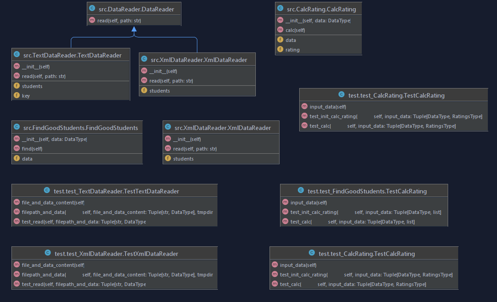

# Лабораторная 1 по дисциплине "Технологии программирования"

Знакомство с системой контроля версий Git и инструментом CI/CD Travis CI

Цели работы:
1. Познакомиться c распределенной системой контроля версий кода Git и ее функциями;
2. Познакомиться с понятиями «непрерывная интеграция» (CI) и «непрерывное развертывание»
(CD), определить их место в современной разработке программного обеспечения;
3. Получить навыки разработки ООП-программ и написания модульных тестов к ним на
современных языках программирования;
4. Получить навыки работы с системой Git для хранения и управления версиями ПО;
5. Получить навыки управления автоматизированным тестированием

Используемые языки:
1. python 3.8.12

Uml диаграмма

Вывод:
В ходе работы было проведено знакомство с: 
1. распределенной системой контроля версий кода Git и ее функциями;
2. понятиями «непрерывная интеграция» (CI) и «непрерывное развертывание»(CD);
Получены навыки:
1. разработки ООП-программ и написания модульных тестов к ним на
современных языках программирования;
2. работы с системой Git для хранения и управления версиями ПО;
3. управления автоматизированным тестированием
